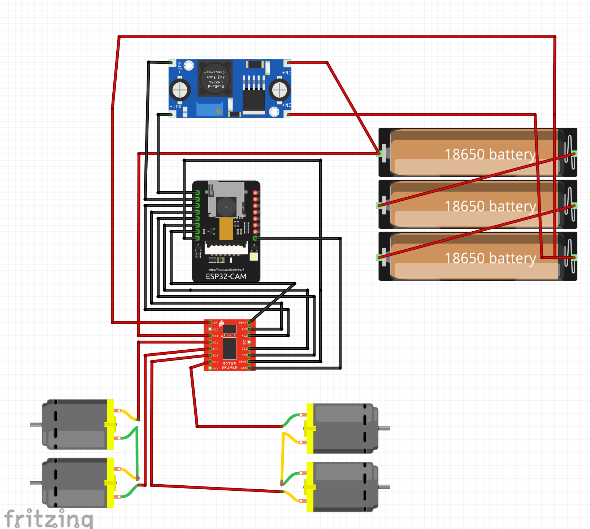
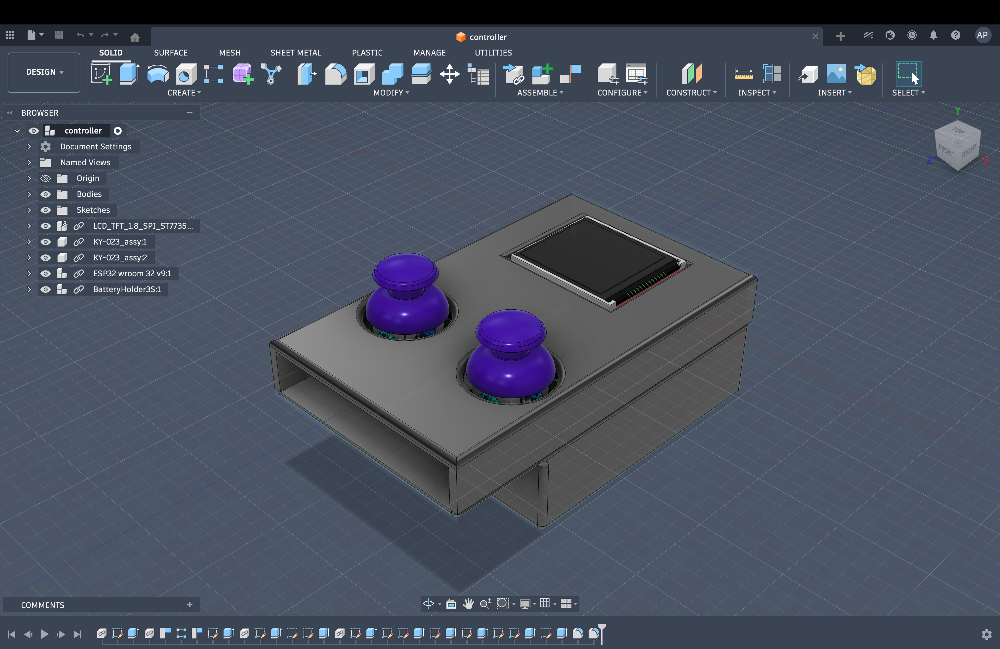
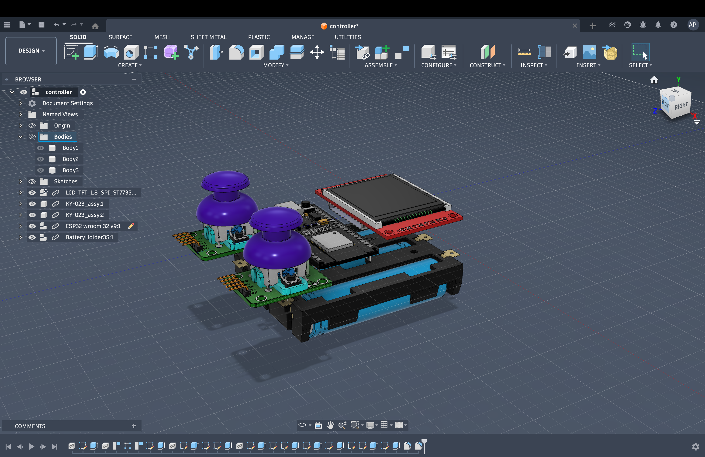
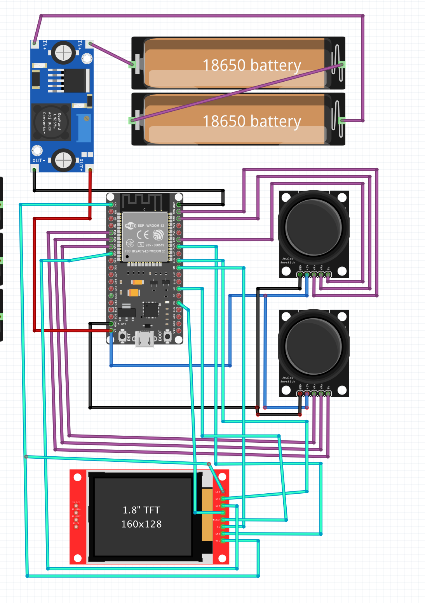

# WiFi FPV RC CAR using ESP32-CAM 

## What is this project
this project is a wifi controller rc car build using esp32-cam for main chasis and esp32 for controller
instead of using traditional remote, i make my own custom controller using esp32, joystick and screen

## How its works
the esp32 of controller and esp32-cam are connected via wifi and send signals like:

joystick -> controller [esp32] -> esp32 cam -> move / stop motor
camera -> esp32cam -> controller -> show on screen

### System flow

The basic plan for comunication between the controller and cas is as follows:

- read input from joystick esp32 [controller]
- send the command over wifi to ep32cam [chasis]
- esp32 cam will send the execute the command and send command to motor driver and its move the car

- esp32 cam will capture video
- send over wifi to esp32 [controller] and then showed on screen

### controller design

the controller have following compoents:

- esp32
- dual joystick
- tft screen

### Car Design

The car is designed using the following components:

- ESP32-CAM
- Motor driver
- 4 DC motors
- Battery system

---

### Circuit Setup

- motor driver connected to esp32-cam
- buck converter used to decrease the voltage for esp32
- capacitor reduce motor noice
## Code

### Car (`car.cpp`)
- runs HTTP server
- receives commands
- controls motors
- captures image 

### Controller (`controller.cpp`)
- read joystick input
- converts them into commands
- send over wifi

## learnings
- reduced design from 3 boards to 2 boards [in start my idea was to use 3 boards 2 for chasis so that esp32-cam send signal to car esp32 then controller esp32]
- fixed motor noice using capactors
- learned esp32 wifi comunication
- learned how screen and esp32-cam works

## How to run
1. Upload `car.cpp` to ESP32-CAM
2. Upload `controller.cpp` to ESP32
3. Connect both to same WiFi
4. Update IP in controller
5. Power both
6. Use joystick

how it should look after build

